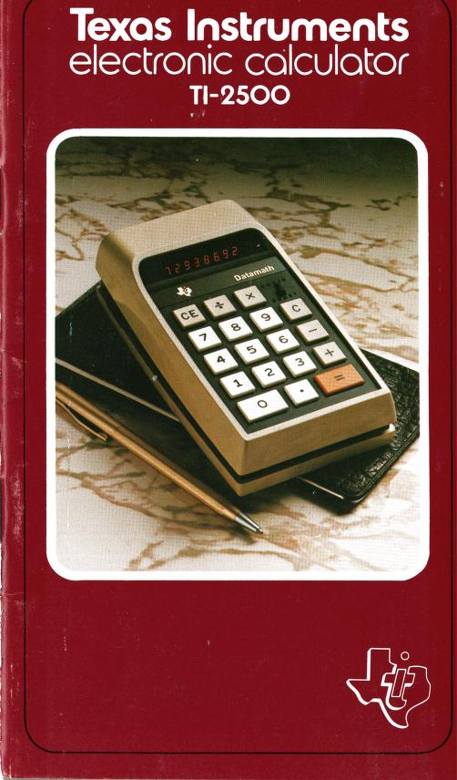

# CalcuBuddy!

 

My calculator buddy, made to get some vanilla frontend experience was modelled after the **TI DataMath 2500**.
***
### [Link to the Manual](https://archive.org/details/texas-instruments-ti-2500-b-calculator/mode/2up)
***
 
The most noticeable difference is the lack of the chain/const switch. I didn't feel like dealing with all that so I just added a special key that plays a little melody.